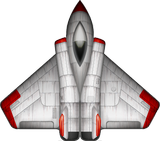

<p align="center">
  
</p>

# Archespace

A modern graphical version of a top-down space shooter. I created this game as my first serious attempt to use SDL, a C++ Graphics Library. 

## Installing

### Prerequisites

Make sure that you have the SDL libraries. You will need:
1. SDL2
    * https://www.libsdl.org/download-2.0.php
2. SDL_Image
    * https://www.libsdl.org/projects/SDL_image/
3. SDL_TTF
    * https://www.libsdl.org/projects/SDL_ttf/
4. SDL_Mixer
    * https://www.libsdl.org/projects/SDL_mixer/
  
If you have trouble installing them, or would like to know how, Lazy Foo Tuturials are a great place to start: http://lazyfoo.net/tutorials/SDL/index.php 

### Compiling

First you need to make sure that the SDL libs are correctally found in the Makefile. 

Goto line 31 and 32 in the Makefile:
``` Makefile
L_SDLC = -IC:\Compiler\SDL\include\SDL2 
L_SDLL = -LC:\Compiler\SDL\lib
```
And replace the libs directories to the correct path. 

After you have that then you can simply run `<make> .\bin\main.exe`. The executable should be created in the `.\bin` folder: `.\bin\main.exe`

## Built With

* [SDL](https://www.libsdl.org/) - Simple DirectMedia Layer

## Contributing

1. Fork it!
2. Create your feature branch: `git checkout -b my-new-feature`
3. Commit your changes: `git commit -am 'Add some feature'`
4. Push to the branch: `git push origin my-new-feature`
5. Submit a pull request :D

## Authors

* **Aryan Gupta** - *The Whole Shebang* - [My Site](https://theguptaempire.net)

## License

Copyright (c) 2017 The Gupta Empire - All Rights Reserved

## Acknowledgments

* Thank you [kenney.nl](https://kenney.nl/) for alot of the sprites
* Thanks for all my friends that gave me inspiration and ideas
* Thanks to anyone else that may have slipped my mind
